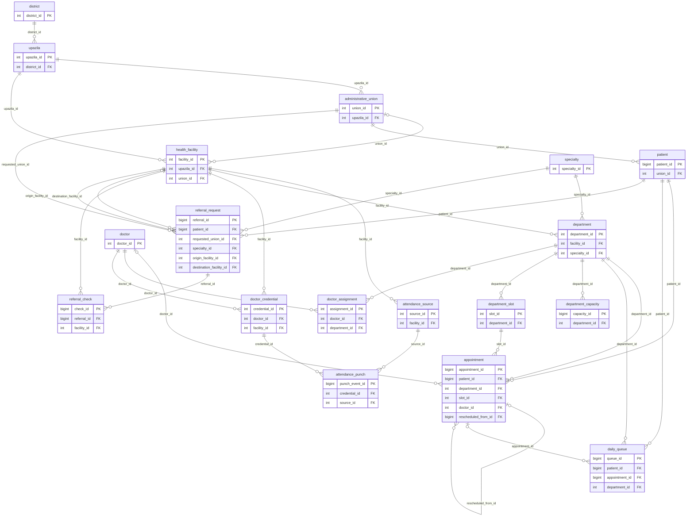

# Entity-relationship diagram

Generated from the foreign keys in `database/referral_path.sql`. Only key columns are shown; see [DATABASE.md](DATABASE.md) for every column.

```mermaid
erDiagram
    administrative_union {
        int union_id PK
        int upazila_id FK
    }
    appointment {
        bigint appointment_id PK
        bigint patient_id FK
        int department_id FK
        int slot_id FK
        int doctor_id FK
        bigint rescheduled_from_id FK
    }
    attendance_punch {
        bigint punch_event_id PK
        int credential_id FK
        int source_id FK
    }
    attendance_source {
        int source_id PK
        int facility_id FK
    }
    daily_queue {
        bigint queue_id PK
        bigint patient_id FK
        bigint appointment_id FK
        int department_id FK
    }
    department {
        int department_id PK
        int facility_id FK
        int specialty_id FK
    }
    department_capacity {
        bigint capacity_id PK
        int department_id FK
    }
    department_slot {
        int slot_id PK
        int department_id FK
    }
    district {
        int district_id PK
    }
    doctor {
        int doctor_id PK
    }
    doctor_assignment {
        int assignment_id PK
        int doctor_id FK
        int department_id FK
    }
    doctor_credential {
        int credential_id PK
        int doctor_id FK
        int facility_id FK
    }
    health_facility {
        int facility_id PK
        int upazila_id FK
        int union_id FK
    }
    patient {
        bigint patient_id PK
        int union_id FK
    }
    referral_check {
        bigint check_id PK
        bigint referral_id FK
        int facility_id FK
    }
    referral_request {
        bigint referral_id PK
        bigint patient_id FK
        int requested_union_id FK
        int specialty_id FK
        int origin_facility_id FK
        int destination_facility_id FK
    }
    specialty {
        int specialty_id PK
    }
    upazila {
        int upazila_id PK
        int district_id FK
    }
    upazila ||--o{ administrative_union : "upazila_id"
    department ||--o{ appointment : "department_id"
    doctor |o--o{ appointment : "doctor_id"
    patient ||--o{ appointment : "patient_id"
    appointment |o--o{ appointment : "rescheduled_from_id"
    department_slot ||--o{ appointment : "slot_id"
    doctor_credential ||--o{ attendance_punch : "credential_id"
    attendance_source ||--o{ attendance_punch : "source_id"
    health_facility ||--o{ attendance_source : "facility_id"
    appointment |o--o{ daily_queue : "appointment_id"
    department ||--o{ daily_queue : "department_id"
    patient ||--o{ daily_queue : "patient_id"
    health_facility ||--o{ department : "facility_id"
    specialty ||--o{ department : "specialty_id"
    department ||--o{ department_capacity : "department_id"
    department ||--o{ department_slot : "department_id"
    department ||--o{ doctor_assignment : "department_id"
    doctor ||--o{ doctor_assignment : "doctor_id"
    doctor ||--o{ doctor_credential : "doctor_id"
    health_facility ||--o{ doctor_credential : "facility_id"
    administrative_union |o--o{ health_facility : "union_id"
    upazila ||--o{ health_facility : "upazila_id"
    administrative_union ||--o{ patient : "union_id"
    health_facility ||--o{ referral_check : "facility_id"
    referral_request ||--o{ referral_check : "referral_id"
    health_facility |o--o{ referral_request : "destination_facility_id"
    health_facility ||--o{ referral_request : "origin_facility_id"
    patient ||--o{ referral_request : "patient_id"
    specialty ||--o{ referral_request : "specialty_id"
    administrative_union ||--o{ referral_request : "requested_union_id"
    district ||--o{ upazila : "district_id"
```
